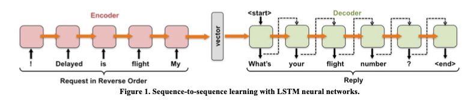
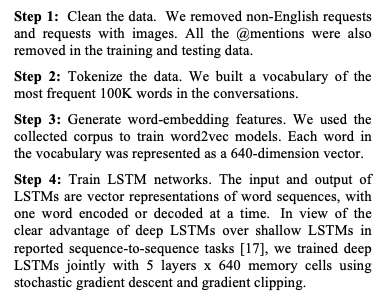

# ABSTRACT
It is mainly for customer service

Show why to do this paper, the user's problem of social media.
Lots of users in social media, they are trying to request or receive customer service. But things is that users can not receive service timely or even can not received.

So this articl is to show they create a chatbot to slove problem that users can receive services on social media.

They get the data from Twitter conversation betweent users to agents. (over 60 brands, 1M Twitter conversations)

# INTRODUCTION 
They used LSTM (Long short-term memory) Network.

The method they used for evaluation part:
- content analysis: The two major themes to user requests on social media: 
    - emotional : More than 40% are *emotional* without specific *informational* intents.
    - informational

# BUILD THE CHATBOT 
In the paper they used word Mapping ? 

mapping one sequence of words as request --> another sequence of words as response

## Sequence - to - Sequence Learning

**2 LSTM networks**

> The core of the system consists of two LSTM neural networks: one as an encoder that maps a variable-length input sequence to a fixed-length vector, and the other as a decoder that maps the vector to a variable-length output sequence (Figure 1). The advantage of LSTM is that it can store sequential information over extended time intervals and learn to block or pass on information depending on its importance. Following [17], the encoder LSTM reads each input sequence in reverse (Figure 1). This helps the learning algorithm establish a connection between two sequences.

## Word Embedding 
They used Word2Vec 
> The idea of word2vec is that each dimension of the embedding represents a latent feature of the word, which can capture useful syntactic and semantic properties. 

## Implementation

Data from Twitter public API.
- Streaming API
- Search API

Three different kinds
- A brand has a Twitter account dedicated to customer service (e.g. ATTCares). 
- A large variety of brands is covered to enhance the generalizability of our findings across product categories.
- National brands are selected so that a national sample from crowdsourcing is suitable for evaluation tasks.

**In their word2Vec, each word has 640 dimensions.**

