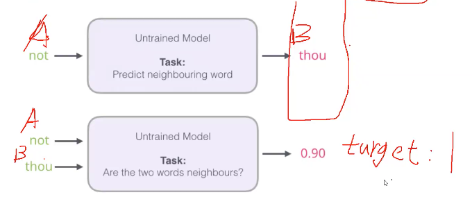

# Word2Vec --- Natrue Language process Word Vector Model
Notes from Andrew Luo(Luo Yifeng)

**Make the word to a vector**

### 1.  The order
The most thing that i learned from Word2Vec differe than the TF-IDF.

When we worked on TF-IDF, When we reverse the order of the words. The Value of Term Frequence is the same. But in the real life , when you change the postion in the sentence or in the doc. The Meaning of the Sentence and the doc is changed. 

**For example:**
- Nature Language Process-----------Understandable
- Language Nature Process-----------Ununderstandable

So in order to let our computer know the meaning of the doc better. We need to let our computer know the sequence of the words as well.

### 2. Same word different express

Nature Language Process and NLP are the Same thing, We can understand but computer can not.

So actully, there are the words means the same, in the nearby postion. So in the 3-d level, the two words should mean the same thing. It is the same logical that we are talking.

So actully, in the some conditions that when two words means 80% same, these two words should be in the around each other in the word vector space. Take the picture as an example:

 
## So how to make the word as a vector?

Take the example as human, How to describe a person? We can give a score to a person, this is the simplest way.

A word is a vector and it's dimension is pettry high. Usually around 50-300 dimensions.(According to the google)

So when we can get the hand to the word vector, we can have a way to calculate the similarity between two words.

As the higher dimension a word vector have, the more information we can get from the word. The output of the calculation is more countable.

### Training the word vector Model

#### Overview

We will used the neural network.

####
1. So what is the inputs and output of our model?
2. What we expect our neural network to learn?

####
1. The answer is that we input our words, and what we want the neural network to do is to predict the next word.
2. To learn how to predict the next word by given a sequence of words.

The output basically the possibility of the word that are coming next. It is as simialr as a output of a softmax function.
Therefore, it is multi-classification problem.

#### A word can not be input into the neural network, so how we can input the word into the NN?
We can look up the embeddings. Get the word vector in the big table of the word. In the big table which is called embeddings table (Self define) to get the word vector.

For more are in the implmention part.

## Compare with two differen model

Word2vec can utilize either of two model architectures to produce a distributed representation of words: continuous bag-of-words (CBOW) or continuous skip-gram. In the continuous bag-of-words architecture, the model predicts the current word from a window of surrounding context words. The order of context words does not influence prediction (bag-of-words assumption). In the continuous skip-gram architecture, the model uses the current word to predict the surrounding window of context words. The skip-gram architecture weighs nearby context words more heavily than more distant context words. According to the authors' note, CBOW is faster while skip-gram is slower but does a better job for infrequent words.

Knowing the context to predict a word in the sentence, we can use CBOW.

Knowing the Word to predict the context, we can use Skip-Gram.

The input will be different.

# Time can be long 
Because it is a multi-classification problem. When the doc catains lots of words, the processing time of our Neural Network can be long. Because the output can have lots of different words. 
One way to improve this is that we not only input the word which we want to predict waht next word after this word, instead we input the word and the word next to it. And we output the possibility of how much the word next to the word can be.

We should except the output value to be 1.
The more the output differ than 1, the more work we need to adjust our neural network. 

This is a good start Point, originally this is a multi-classification problem. We canvert it into a binary calssification problem. True or False. But this can lead to one issue. If we are doing this, the Output of our Neural Network are all ones, this can not be a good training for our Neural Network.

**So we need to add some words that is not in the doc previously.**

So we need to use Negativesample-model.

We will use gensim package.

Source From:
- Goldberg, Yoav, and Omer Levy. "word2vec Explained: deriving Mikolov et al.'s negative-sampling word-embedding method." arXiv preprint arXiv:1402.3722 (2014).
- https://www.kaggle.com/pierremegret/gensim-word2vec-tutorial
- https://www.bilibili.com/video/BV1F7411x749?p=2&spm_id_from=pageDriver
- https://www.youtube.com/watch?v=Z1VsHYcNXDI
- https://www.google.com/search?sxsrf=ALeKk00_iRRwGn_ugTWkxm8EsI2HjcEtMA%3A1612874806719&ei=NoQiYPqwK9el-Qb_8IvoDA&q=softmax+vs+sigmoid&oq=softmax+&gs_lcp=CgZwc3ktYWIQARgAMgQIABBDMgQIABBDMgQIABBDMgQIABBDMgQIABBDMgQIABBDMgQIABBDMgQIABBDMgQIABBDMgUIABDLAToHCAAQRxCwAzoHCAAQsAMQQ1CgE1igE2DqImgBcAJ4AIABjQOIAckEkgEHMC4xLjAuMZgBAKABAaoBB2d3cy13aXrIAQrAAQE&sclient=psy-ab
- https://en.wikipedia.org/wiki/Word2vec
  

