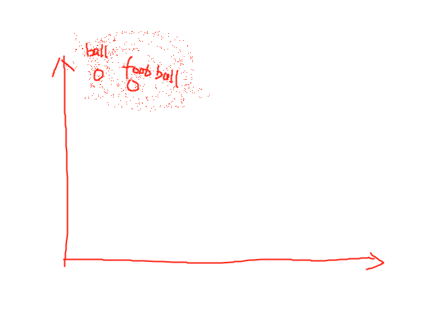

# Word2Vec --- Natrue Language process Word Vector Model

Make the word to a vector

## 1.  The order
The most thing that i learned from Word2Vec differe than the TF-IDF.

When we worked on TF-IDF, When we reverse the order of the words. The Value of Term Frequence is the same. But in the real life , when you change the postion in the sentence or in the doc. The Meaning of the Sentence and the doc is changed. 

**For example:**
- Nature Language Process-----------Understandable
- Language Nature Process-----------Ununderstandable

So in order to let our computer know the meaning of the doc better. We need to let our computer know the sequence of the words as well.

## 2. Same word different express

Nature Language Process and NLP are the Same thing, We can understand but computer can not.

So actully, there are the words means the same, in the nearby postion. So in the 3-d level, the two words should mean the same thing. It is the same logical that we are talking.

So actully, in the some conditions that when two words means 80% same, these two words should be in the around each other in the word vector space. Take the picture as an example:

 

 

